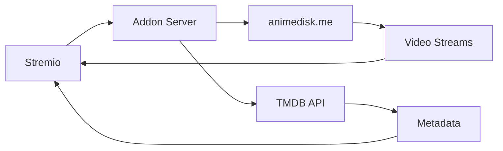

# 🎬 Animedisk Stremio Addon

A **fully functional** Stremio addon that streams anime from animedisk.me with TMDB metadata integration. Stream Hindi dubbed and subbed anime directly in Stremio!

[](https://opensource.org/licenses/MIT)
[](https://nodejs.org/)
[](https://www.stremio.com/)

---

## ⚡ Quick Start

**Want to start immediately?** → [**Quick Start Guide**](QUICKSTART.md)

**5-Minute Setup:**
1. Go to [Replit](https://replit.com)
2. Import from GitHub: `https://github.com/veera590/anime-streaming-addon`
3. Click "Run"
4. Install in Stremio: `https://your-repl-url.repl.co/manifest.json`

---

## ✨ Features

- ✅ **Real streaming links** - Direct .m3u8 and .mp4 URLs (no torrents)
- ✅ **TMDB integration** - Enhanced posters, descriptions, and ratings
- ✅ **IMDB mapping** - Links Stremio's IMDB IDs to Animedisk content
- ✅ **Hindi dubbed & subbed** - Anime in Hindi and regional languages
- ✅ **Multiple catalogs** - TV Series, Movies, and Most Popular
- ✅ **Episode tracking** - Proper season and episode numbering
- ✅ **Smart caching** - Fast performance (15-30 min cache)
- ✅ **Easy deployment** - One-click deploy to Replit

### Inspired By
This addon is built using proven patterns from the [anime-world-stremio-addon](https://github.com/skoruppa/anime-world-stremio-addon) but adapted for animedisk.me with Node.js.

---

## 📚 Documentation

| Guide | Description |
|-------|-------------|
| **[Quick Start](QUICKSTART.md)** | Get started in 5 minutes |
| **[Deployment Guide](DEPLOYMENT.md)** | Complete deployment options |
| **[Features](FEATURES.md)** | Technical details & architecture |
| **[Contributing](#-contributing)** | How to contribute |

---

## 🚀 Installation

### Option 1: Replit (Recommended - Free & Easy)

Perfect for non-developers:

1. **Create Account**: Go to [replit.com](https://replit.com) and sign up
2. **Import Project**: Click "Create Repl" → "Import from GitHub"
3. **Paste URL**: `https://github.com/veera590/anime-streaming-addon`
4. **Run**: Click the "Run" button
5. **Get URL**: Copy your Replit URL from the browser window
6. **Install in Stremio**:
   - Open Stremio → Addons → Community Addons
   - Paste: `https://your-replit-url.repl.co/manifest.json`
   - Click Install

**Keep it alive**: Use [UptimeRobot](https://uptimerobot.com) (free) to ping your URL every 5 minutes.

### Option 2: Local Development

For developers:

```bash
# Clone repository
git clone https://github.com/veera590/anime-streaming-addon.git
cd anime-streaming-addon

# Install dependencies
npm install

# Start server
npm start

# Server runs on http://localhost:7000
```

Install in Stremio: `http://localhost:7000/manifest.json`

### Option 3: Docker

```bash
# Build image
docker build -t animedisk-addon .

# Run container
docker run -d -p 7000:7000 animedisk-addon

# Or use docker-compose
docker-compose up -d
```

Install in Stremio: `http://localhost:7000/manifest.json` or `http://your-server-ip:7000/manifest.json`

### Other Options

See [DEPLOYMENT.md](DEPLOYMENT.md) for:
- Railway (easiest cloud hosting)
- Render (free tier with auto-deploy)
- Heroku (paid)
- VPS (full control)
- And more...

---

## 🎯 How It Works



1. **Catalog**: Scrapes animedisk.me for anime lists
2. **Meta**: Fetches details + enriches with TMDB data
3. **Stream**: Extracts video URLs from episode pages
4. **Mapping**: Links IMDB IDs to Animedisk slugs

---

## 🏗️ Project Structure

```
anime-streaming-addon/
├── handlers/
│   ├── catalog.js       # Anime listings
│   ├── meta.js          # Anime details + episodes
│   └── stream.js        # Video URL extraction
├── utils/
│   ├── scraper.js       # HTML parsing utilities
│   ├── tmdb.js          # TMDB API integration
│   ├── database.js      # IMDB mapping storage
│   └── mapper.js        # IMDB <-> Slug mapping
├── config.js            # Configuration
├── manifest.js          # Stremio manifest
├── index.js             # Server entry point
├── test.js              # Test suite
└── package.json         # Dependencies
```

---

## 🧪 Testing

### Run Test Suite

```bash
npm test
```

This will test:
- ✅ Catalog fetching
- ✅ Metadata extraction
- ✅ Episode listing
- ✅ Stream URL extraction

### Manual Testing

```bash
# Test manifest
curl http://localhost:7000/manifest.json

# Test catalog
curl http://localhost:7000/catalog/series/animedisk-anime.json

# Test metadata
curl http://localhost:7000/meta/series/animedisk:naruto-shipp-den-59.json

# Test stream (replace with actual IDs from meta response)
curl http://localhost:7000/stream/series/animedisk:naruto-shipp-den-59:1.json
```

---

## ⚙️ Configuration

Edit `config.js`:

```javascript
module.exports = {
  BASE_URL: 'https://animedisk.me',
  TMDB_API_KEY: 'your-api-key-here',  // Already embedded
  CACHE_TTL: 900,              // 15 min for catalogs
  STREAM_CACHE_TTL: 600,       // 10 min for streams
  DETAILS_CACHE_TTL: 1800,     // 30 min for details
};
```

---

## 📺 Supported Content

### Catalogs
- **Animedisk TV Series** - Latest and ongoing anime
- **Animedisk Movies** - Anime films
- **Most Popular** - Trending anime

### Languages
- Hindi Dubbed
- Hindi Subbed
- Tamil, Telugu, Malayalam, Bengali, Marathi

### Formats
- **HLS (.m3u8)** - Adaptive streaming
- **MP4 (.mp4)** - Direct download/stream

---

## 🔧 Troubleshooting

### No catalogs showing?
- Check if animedisk.me is accessible
- Verify Replit/server is running
- Check server logs for errors

### No streams found?
- Try different anime/episodes
- Website structure may have changed
- Check console logs for extraction errors

### Streams won't play?
- Some streams may be geo-restricted
- Try using a VPN
- Check internet connection

### Addon won't install?
- Ensure URL ends with `/manifest.json`
- Check if server is accessible
- Try in a private/incognito window

See [DEPLOYMENT.md](DEPLOYMENT.md) for more troubleshooting.

---

## 🤝 Contributing

We welcome contributions! Here's how:

### Report Issues
- Website structure changes
- Broken streams
- Feature requests

### Submit Pull Requests
1. Fork the repository
2. Create feature branch: `git checkout -b feature/amazing-feature`
3. Commit changes: `git commit -m 'Add amazing feature'`
4. Push to branch: `git push origin feature/amazing-feature`
5. Open Pull Request

### Development Setup
```bash
git clone https://github.com/veera590/anime-streaming-addon.git
cd anime-streaming-addon
npm install
npm run dev  # Auto-reload on changes
```

---

## 📈 Performance

### Expected Response Times
- **Catalog**: 2-5 seconds
- **Metadata**: 3-7 seconds
- **Streams**: 5-10 seconds
- **Cache hits**: < 100ms

### Optimization Tips
- Increase cache TTL in `config.js`
- Use Redis for distributed caching
- Deploy closer to your location
- Use a CDN (Cloudflare)

---

## 🔒 Security & Privacy

- ✅ No user data collected
- ✅ No tracking or analytics
- ✅ No ads injected
- ✅ Direct streaming (no proxying)
- ✅ Open source (inspect the code)

---

## 📄 License

MIT License - see [LICENSE](LICENSE) file

Free to use, modify, and distribute. Attribution appreciated but not required.

---

## 🙏 Credits

### Inspiration
- [anime-world-stremio-addon](https://github.com/skoruppa/anime-world-stremio-addon) by skoruppa
  - Architecture patterns
  - IMDB mapping system
  - Stream extraction approach

### Technologies
- [Stremio Addon SDK](https://github.com/Stremio/stremio-addon-sdk)
- [TMDB API](https://www.themoviedb.org/)
- [Cheerio](https://cheerio.js.org/) - HTML parsing
- [Axios](https://axios-http.com/) - HTTP client
- [node-cache](https://www.npmjs.com/package/node-cache) - Caching

### Content Source
- [animedisk.me](https://animedisk.me) - Anime streaming platform

---

## ⚠️ Disclaimer

This addon is for **educational purposes** only. It does not host any content - it simply provides links to publicly available streams on animedisk.me. 

Please support the official anime industry by:
- Subscribing to legal streaming services
- Purchasing official merchandise
- Watching on licensed platforms when available

---

## 📞 Support

- **Issues**: [GitHub Issues](https://github.com/veera590/anime-streaming-addon/issues)
- **Discussions**: [GitHub Discussions](https://github.com/veera590/anime-streaming-addon/discussions)
- **Quick Start**: [QUICKSTART.md](QUICKSTART.md)
- **Deployment**: [DEPLOYMENT.md](DEPLOYMENT.md)
- **Features**: [FEATURES.md](FEATURES.md)

---

## 🌟 Star History

If you find this addon useful, please star ⭐ the repository!

---

## 📊 Status

- **Status**: ✅ Active Development
- **Version**: 1.0.0
- **Node.js**: >= 16.0.0
- **Stremio**: Compatible with all versions

---

**Made with ❤️ for anime fans worldwide** 🌏

[⬆ Back to Top](#-animedisk-stremio-addon)
